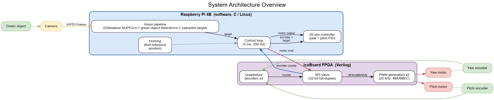
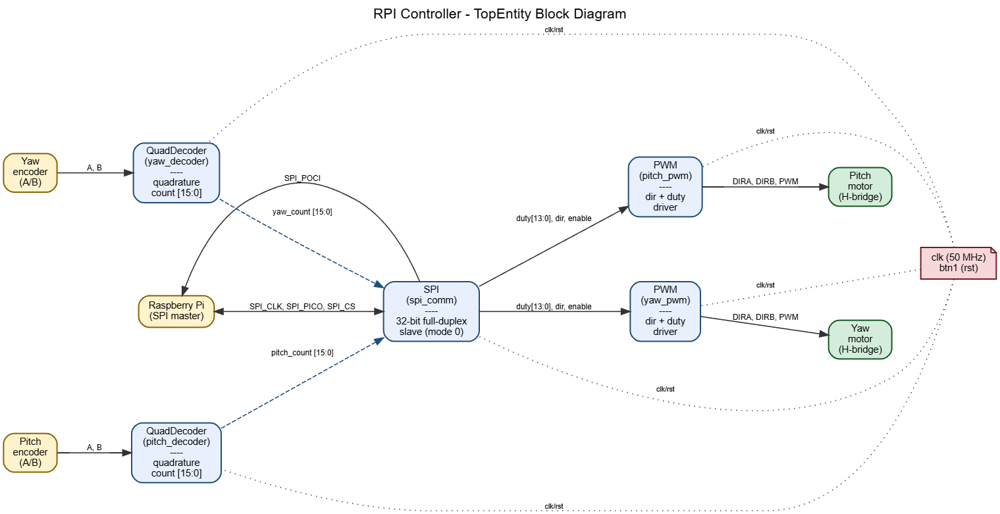
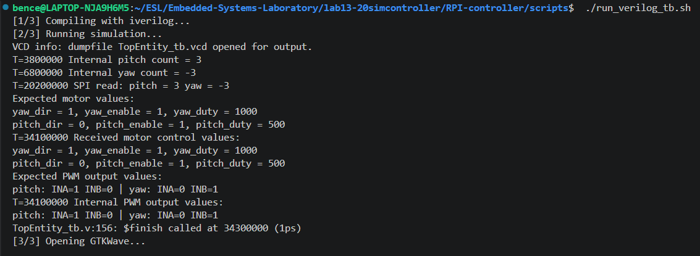
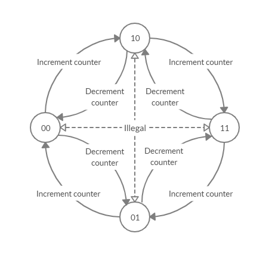
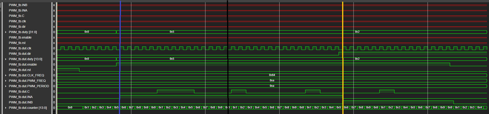
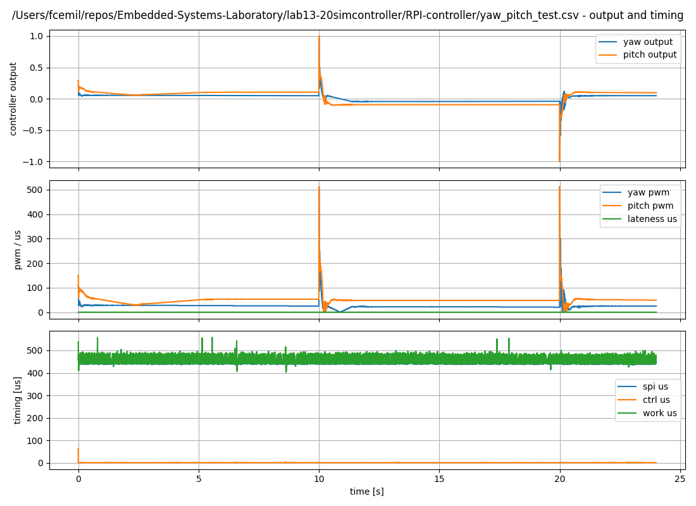
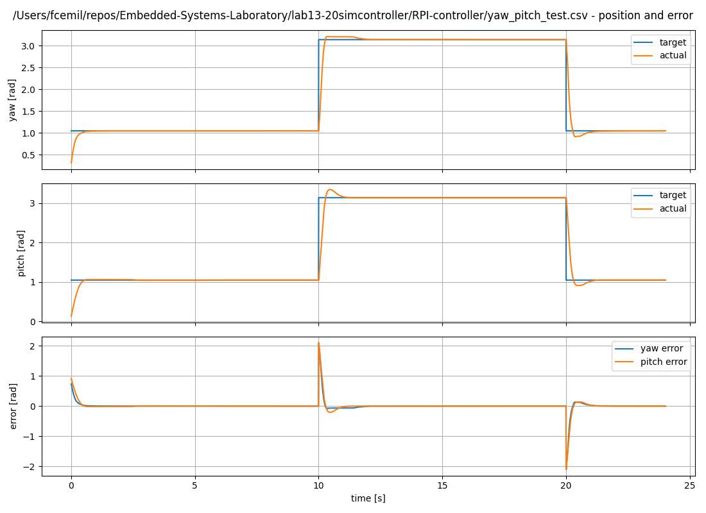
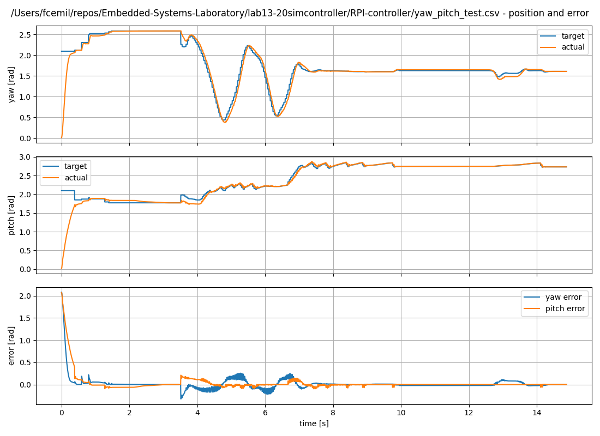
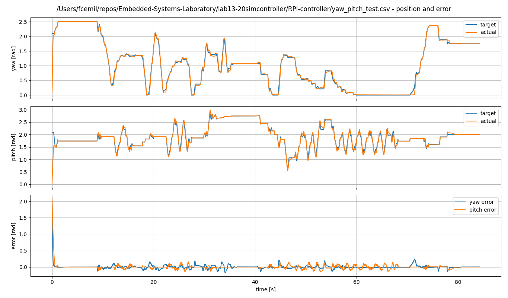
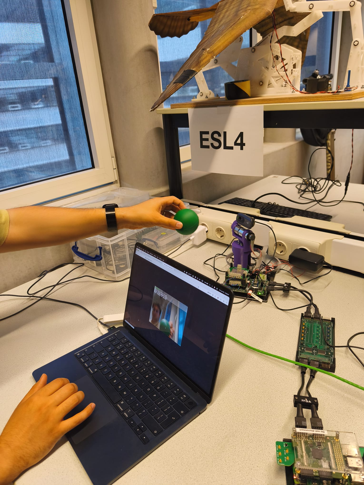

::: center
June 2026
:::

# Introduction

This report presents the design, implementation, and evaluation of our
vision-in-the-loop motor control demonstrator developed in the Embedded
Systems Laboratory.

A key part of the project is the Design Space Exploration between the
Raspberry Pi with icoBoard and the DE10-Nano platform. After comparing
processing capability, FPGA resources, communication architecture, and
implementation effort, one platform was selected as the final
demonstrator.

Finally, the report describes the implemented system, and evaluates its
performance in terms of timing, resource usage and overall system
performance. While also reflecting on the created demonstrator and the
learning points of the course.

# Design Space Exploration

## Goal of the comparison

The purpose of this comparison is to determine which platform is most
suitable for implementing the vision-in-the-loop motor control
demonstrator. The evaluation focuses on the properties that have the
largest effect on performance, integration complexity, and development
feasibility within the available lab time.

The comparison therefore considers the following aspects:

- CPU: available processing performance

- FPGA: available hardware resources

- Communication efficiency between software and hardware components.

- Overall implementation effort and development convenience.

## Raspberry Pi platform

The Raspberry Pi 4 Model B is based on a Broadcom BCM2711 SoC with a
quad-core ARM Cortex-A72 64-bit processor running at up to 1.8 GHz and
using 4Gbytes of LPDDR4 memory. It also exposes a 40-pin GPIO header,
making it a flexible embedded Linux platform.

In the laboratory setup, the RPI is paired with an external FPGA board
sitting on a HAT, namely the iCE40-based icoBoard; which is a compact
low-power SRAM FPGA. This RPI + FPGA setup communicates through the GPIO
header using SPI.

For the final demonstrator, this platform is attractive because the
Raspberry Pi can handle the higher-level software tasks. These include
the camera pipeline, image processing, homing procedure, and the 20-sim
control loop. The icoBoard can then be used for the lower-level hardware
tasks, such as reading the quadrature encoders and generating PWM
signals for the motors. This gives a clear split between software and
hardware.

## DE10-Nano platform

The DE10-Nano is built around a Cyclone V SoC FPGA that combines two
major subsystems in one device: a dual-core ARM Cortex-A9 Hard Processor
System (HPS) at 800 MHz, having 1 GB DDR3 memory and Cyclone V FPGA
fabric.

The most important architectural property is that the ARM processor and
FPGA fabric are integrated into the same SoC.

This makes the DE10-Nano interesting for hardware-software co-design.
The HPS can run the software part of the demonstrator, while the FPGA
fabric can implement encoder reading, PWM generation, or other hardware
blocks. Because both parts are inside the same SoC, communication can be
done through internal memory-mapped interfaces instead of an external
SPI connection.

## Processor comparison

At CPU level, the Raspberry Pi 4B has the stronger general purpose
processor. Its quad-core Cortex-A72 at 1.8 GHz significantly more
capable for Linux side computation than the DE10-Nano's dual-core
Cortex-A9 at 800 MHz. For workloads such as camera handling, image
processing or remote streaming the Raspberry Pi has a clear advantage.

However, processor speed alone does not decide the final architecture.
The controller performance can still be limited by nondeterministic
Linux scheduling and CPU-FPGA communication overhead. Therefore,
communication and FPGA resources also have to be compared.

## FPGA comparison

The FPGA side differences also stand out. The RPI uses a Lattice iCE40
FPGA on the icoBoard, while the DE10-Nano uses a Cyclone V FPGA.

The DE10-Nano board provides a substantially larger and more capable
FPGA fabric having 110K LUTs. In contrast, the iCE40 only has 7680 LUTs
and is the platform for more compact designs.

For this demonstrator, the FPGA tasks are not very large. The FPGA
mainly has to read two quadrature encoders, decode SPI messages, and
generate PWM and direction signals for two motors. These tasks do not
require a very large FPGA. Therefore, the larger FPGA fabric of the
DE10-Nano is an advantage, but it is not a deciding factor for this
project.

## Communication architecture

On the RPI platform, the processor and FPGA communicate via SPI over the
40-pin GPIO header. This means that encoder data and control commands
must be serialized into custom messages. Such a design introduces extra
software handling. Every interaction with FPGA logic requires a bus
transaction with framing and explicit master slave coordination.

On the DE10-Nano platform, the ARM processor communicates with FPGA
logic through the Avalon Bus, using memory-mapped interfaces exposed
through Platform Designer. This is a much shorter architectural path,
software can read or write FPGA exposed registers directly through
mapped addresses. For control tasks, this reduces latency and simplifies
software-hardware communication.

Because of this, the DE10-Nano has the better communication
architecture. However, the communication need of our demonstrator is
small. Only encoder values and motor commands have to be exchanged in
each control step. Therefore, SPI is less elegant than Avalon, but still
suitable for this project.

## Software vs hardware partitioning

Another important design choice is the division between software and
hardware. In the selected architecture, the Raspberry Pi runs the
high-level software tasks. These are the camera pipeline, image
processing, homing procedure, and 20-sim control loop. These tasks are
easier to develop and change in C on Linux.

The FPGA is used for the low-level hardware tasks. These are quadrature
encoder decoding, PWM generation, and motor direction output. These
tasks are close to the physical signals and benefit from deterministic
hardware behavior.

This partitioning keeps the FPGA design small and simple. It also keeps
the image processing and controller code flexible on the Raspberry Pi. A
more hardware-heavy solution could give lower latency, but it would
require more design time and more testing. For this project, the
selected partitioning gives a good balance between performance and
development effort.

## Development convenience

From a development perspective, the Raspberry Pi platform was by far the
more convenient option for our group. We had already worked with the RPI
ecosystem before, so the software environment and general debugging
process were already familiar. This made it easier to iterate quickly
and focus on integration instead of spending time learning the platform
itself. It was also easy to create custom scripts facilitating the Linux
tools (gcc, make, Yosys and nextpnr), as a result testing small changes
and debugging software-hardware interaction was extremely fast.

In contrast, the DE10-Nano platform required Quartus and Platform
Designer. This workflow was more complex and slower for our group.
Creating a new bitstream and testing one small change on the device
could take around 15 minutes. Also, Platform Designer introduces more
configuration steps. Small mistakes in the hardware setup or interface
configuration can cost a lot of time to find and fix.

Due to the limited lab time, this difference in development speed was a
major factor. The DE10-Nano has a stronger hardware-software integration
architecture, but the Raspberry Pi platform allowed faster testing and
debugging. For this project, that practical advantage was very
important.

## Price

From a cost perspective, the Raspberry Pi 4B combined with the icoBoard
is the less expensive option. Using the estimated prices in this
project, the Raspberry Pi 4B costs approximately 50 Euro and the
icoBoard about 90 Euro, resulting in a total platform cost of 140 Euro.
The DE10-Nano, in comparison, has an estimated cost of 180 Euro.

Although the price difference is not very large, the Raspberry Pi based
solution still offers a modest cost advantage. For this reason, cost
slightly favors the Raspberry Pi 4B + icoBoard platform, even though
price was not the dominant factor in the final decision.

## Comparison table

  **Aspect**                    Raspberry Pi 4B + icoBoard                                                                                                          DE10-Nano (Cyclone V SoC)
  ----------------------------- ----------------------------------------------------------------------------------------------------------------------------------- ----------------------------------------------------------------------------------------------------------
  **CPU subsystem**             Quad-core Cortex-A72, 64-bit, up to 1.8 GHz; stronger general purpose compute platform of the two.                                  Dual-core Cortex-A9, 800 MHz; weaker as a pure CPU platform.
  **FPGA subsystem**            External Lattice iCE40 FPGA HAT connected to the setup. Suitable for peripheral logic, but looser integration with the processor.   Cyclone V FPGA fabric inside the same SoC as the ARM HPS. Better suited for hardware-software co-design.
  **CPU-FPGA communication**    External SPI over GPIO header. Simple, but adds serialization overhead.                                                             Internal memory-mapped interconnect through Avalon Bus. Good performance and tighter integration.
  **Software performance**      Strong for Linux applications, camera handling, image processing and remote streaming.                                              Adequate for controller software, but might be too weak for the image processing pipeline.
  **Development convenience**   Very convenient RPI software ecosystem enabling rapid iteration.                                                                    Tremendous effort due to Quartus toolchain.

  : Comparison for DSE

## Considered alternatives

- Raspberry Pi 4 + icoBoard: image processing and control loop in
  software on the Raspberry Pi; FPGA only used for low-level hardware
  control.

- DE10-Nano: image processing and controller executed on the ARM HPS;
  encoder and PWM implemented as FPGA IP blocks accessed through the
  Avalon memory-mapped interface.

## DSE decision matrix

The decision matrix uses a score from 1 (poor) to 5 (excellent). The
weighted score is obtained by multiplying each criterion score by its
weight and summing the results for each alternative. Development speed
has the highest weight, because the final demonstrator had to be
integrated and tested within limited lab time.

::: {#tab:weighted_dse}
  **Criterion**             **Weight**   **RPi + icoBoard**   **DE10-Nano**
  ------------------------ ------------ -------------------- ---------------
  Development speed             5                5                  2
  Debuggability                 3                4                  3
  CPU-FPGA communication        4                3                  5
  Image processing ease         3                5                  3
  FPGA resource fit             3                5                  5
  Cost                          1                4                  3
  **Total**                                    **83**            **66**

  : Weighted trade-off table for final architecture selection
:::

## Chosen architecture

Based on the weighted trade-off table, the Raspberry Pi 4B combined with
the icoBoard is selected as the preferred platform for the final
demonstrator.

The main reason for this outcome is that the Raspberry Pi platform
scores better on development speed, debug convenience, and image
processing. These criteria were given a relatively high weight in the
decision matrix, because the demonstrator had to be implemented and
tested within limited lab time. The Raspberry Pi also offers a more
suitable environment for the camera pipeline and image processing part
of the system.

The DE10-Nano is attractive from an architectural point of view. Its ARM
processor and FPGA fabric are tightly connected through the Avalon
memory-mapped interface. This is useful for hardware-software co-design
and gives better CPU--FPGA communication. However, in this project, the
extra implementation effort and slower toolchain were major
disadvantages.

Therefore, the selected architecture uses the Raspberry Pi for the
high-level software tasks and the icoBoard FPGA for the low-level
hardware tasks. This gives enough performance for the demonstrator while
keeping the development process manageable.

## Float vs Int in control loop

Another design choice in the demonstrator is whether the input and
internal computations of the 20-sim generated PID controller should be
represented using floating point or integer arithmetic.

Using integers would likely reduce computational cost, but it would also
require an additional fixed-point design effort. Scaling factors would
have to be introduced for the encoder conversion, controller state
variables, and actuator output, and these would need validation to
prevent overflow or loss of resolution. For the demonstrator with
limited implementation time, this extra effort might not worth it.

The generated 20-sim controller expects its input signals in SI units,
meaning that encoder values must be converted to radians before they are
processed by the controller. This conversion nicely fits a floating
point representation, since angular position, controller gain, and
intermediate PID terms are not limited to integer values and might
require fractional precision. Also, on the selected Raspberry Pi
platform, the computational overhead of floating point arithmetic is
small compared to the available CPU performance, making it the practical
choice.

## JPEG vs YUV for image processing

Another design choice is the image format used in the vision pipeline.
The assignment mentions source quality and required processing power as
part of the design space. For this demonstrator, the camera pipeline
uses MJPEG input from the camera and decodes it to RGB before image
processing.

Using MJPEG has the advantage that the camera can send compressed
frames. This can reduce the amount of data transferred from the camera
compared to raw frames. However, the frames must be decoded before they
can be processed. This adds some CPU work on the Raspberry Pi.

After decoding, the image is converted to RGB. This is useful for the
green object detection, because the color of each pixel is available as
red, green, and blue values. From these RGB values, the hue can also be
calculated for HSV-style filtering. This makes it easier to select green
pixels than using only direct RGB thresholds.

A YUV-based implementation could be more efficient in some cases,
because it may avoid some conversion steps. However, YUV does not
directly give hue information. We would either need to design a
different thresholding method using Y, U, and V values, or convert the
pixels back to RGB before calculating HSV-like values. For this project,
RGB with hue-based filtering was easier to understand, tune, and test.

For this project, the main goal was to create a working and
understandable vision-in-the-loop demonstrator within the available
time. Therefore, using MJPEG input with RGB processing was selected as a
practical choice.

# Implementation

## System Architecture

<figure id="fig:system_architecture" data-latex-placement="h">

<figcaption>System architecture overview</figcaption>
</figure>

The final demonstrator is a vision-in-the-loop motor control system. The
system uses a Raspberry Pi 4B together with the icoBoard FPGA. The
Raspberry Pi is responsible for the high-level software tasks, while the
FPGA is responsible for the low-level hardware signals.

The camera is connected to the Raspberry Pi. The Raspberry Pi runs the
camera pipeline and image processing code. The image processing finds
the green object in the camera frame and converts its position into yaw
and pitch target values. These target values are then used by the
control loop.

The control loop runs on the Raspberry Pi. It reads the current encoder
positions through SPI, converts the encoder counts to radians, runs the
20-sim controller, and sends new motor commands back to the FPGA. The
FPGA receives these commands and generates the PWM and direction signals
for the pitch and yaw motors.

The FPGA also reads the quadrature encoder signals from both motors.
These encoder counts are sent back to the Raspberry Pi during the SPI
exchange. In this way, the system forms a closed loop: the camera gives
the target, the controller drives the motors, and the encoders give
feedback about the actual motor positions.

## FPGA implementation

The FPGA design is responsible for the low-level hardware control of the
JIWY setup. It receives the encoder signals, communicates with the
Raspberry Pi through SPI, and generates the motor control signals. The
design is written in Verilog and is built around one top-level module.

The FPGA part contains three main types of modules. The quadrature
decoder modules read the encoder A/B signals. The SPI module exchanges
encoder values and motor commands with the Raspberry Pi. The PWM modules
generate the direction and PWM outputs for the H-bridges.

### Top Module

<figure id="fig:top_entity" data-latex-placement="h">

<figcaption>Verilog modules</figcaption>
</figure>

Figure [2](#fig:top_entity){reference-type="ref"
reference="fig:top_entity"} contains the top level entity, which
instantiates five hardware modules. The SPI module acting like the
bridge between the RPI and the FPGA. Two QuadDecoder instances sample
the A/B quadrature signals from the pitch and yaw JIWY encoders to
produce the position counters. On the output side, two PWM modules use
the decoded duty cycle and direction to generate the INA/INB direction
signals and the PWM speed signal for each motor's H-bridge. A single 50
MHz clock and a push-button reset (btn1) are distributed to every
submodule, keeping the whole design in one synchronous domain.

We have implemented a testbench for the TopEntity, that verifies the
integration of all the separate Verilog modules. The test exercises both
quadrature decoders by manually stepping the encoder A/B signals through
a forward and backward sequence to confirm, that they increment and
decrement correctly. It also includes an SPI transfer task, that mocks
the communication from the master side to read back the encoder values
and to write the PWM control signals. Figure
[3](#fig:top_tb){reference-type="ref" reference="fig:top_tb"} shows the
results of running the testbench.

<figure id="fig:top_tb" data-latex-placement="h">

<figcaption>Output of the TopEntity_tb</figcaption>
</figure>

### Quadrature decoder

The quadrature decoder module is used to read the position of the pitch
and yaw axes. Each encoder gives two digital signals, A and B. These
signals are phase shifted. By looking at the order of the A/B
transitions, the FPGA can determine both the movement direction and the
number of encoder steps.

The design uses two instances of the same `QuadDecoder` module. One
instance is used for the pitch encoder and one instance is used for the
yaw encoder. Each decoder outputs a signed 16-bit counter. The counter
increases when the axis moves in one direction and decreases when it
moves in the other direction. The implementation is based on the state
machine depicted on Figure [4](#fig:decoder){reference-type="ref"
reference="fig:decoder"}.

<figure id="fig:decoder" data-latex-placement="h">

<figcaption>Decoder state machine</figcaption>
</figure>

Because the encoder signals are external signals, they are first sampled
inside the FPGA clock domain. The module uses a small synchronizer
before the state machine. After this, the state machine checks the
current A/B state and updates the counter when a valid transition is
detected.

The reset signal clears the counter and returns the decoder to the
initial state. This is useful when starting the system, because the
software homing procedure can then define the reference position for the
controller.

A 16-bit signed counter was selected for each encoder. During the first
tests with the old setup, the measured encoder values were around 2500
counts over the useful movement range. Because of this, 16 bits was
enough and also easy to handle in the SPI protocol. Each encoder value
could be sent as one signed 16-bit number. Using 16-bit values also
keeps the SPI frame simple, because the pitch and yaw encoder values
together fit in 32 bits.

Later, the setup changed to the new JIWY version. The new setup uses a
5.3:1 gear reduction and 1024 CPR encoders on the motor shaft. This
increases the encoder count range a lot compared to the first
measurements. However, the 16-bit signed range is still large enough for
the expected movement range of the setup. Therefore, the implementation
did not need to be changed.

### PWM generator

The PWM generator module is used to drive the motor H-bridge. There are
two instances of this module in the design: one for the pitch motor and
one for the yaw motor. Each module generates three output signals:
`INA`, `INB`, and `C`. The `INA` and `INB` signals set the motor
direction, while `C` is the PWM speed signal.

The FPGA clock is 50 MHz and the selected PWM frequency is 20 kHz. This
frequency was chosen because it is above the normal human hearing range.
Because of this, the PWM signal should not create an audible motor tone
during operation.

With a 50 MHz clock and a 20 kHz PWM frequency, one PWM period contains:
$$\frac{50\,000\,000}{20\,000} = 2500$$ clock ticks. This means that the
duty cycle can be controlled with 2500 different values. This gives
enough resolution for the motor speed control in this demonstrator.

The duty value inside the PWM module is 14 bits wide. This is enough,
because 14 bits can represent values up to 16383, which is much larger
than the required 2500 PWM ticks. In the SPI command, each motor command
is stored in a 16-bit field. This field contains the direction bit, the
enable bit, and the duty value. This keeps the communication format
simple while still giving enough PWM resolution.

When the enable signal is active, the PWM module sets the motor
direction and compares the duty value with the internal counter. If the
counter is smaller than the duty value, the PWM output is high.
Otherwise, it is low. When the enable signal is not active, both
direction signals and the PWM output are set to zero. This gives a safe
stop state for the motor.

Figure [5](#fig:pwm_tb){reference-type="ref" reference="fig:pwm_tb"}
shows the PWM testbench waveform. The waveform shows that the output
changes according to the duty value, direction, and enable signal.

<figure id="fig:pwm_tb" data-latex-placement="h">

<figcaption>PWM generator testbench waveform</figcaption>
</figure>

The PWM signal was also checked on the real setup using a logic
analyzer. Figure [6](#fig:pwm_pulseview){reference-type="ref"
reference="fig:pwm_pulseview"} shows the PWM output in PulseView.
Channel D0 shows a low duty-cycle PWM signal, approximately 10%. This
confirms that the FPGA output was producing PWM pulses on the hardware,
not only in simulation.

<figure id="fig:pwm_pulseview" data-latex-placement="h">

<figcaption>PWM output checked with PulseView</figcaption>
</figure>

### SPI slave

The SPI slave module is the communication bridge between the Raspberry
Pi and the FPGA. The Raspberry Pi acts as the SPI master, while the FPGA
acts as the SPI slave. The module uses SPI mode 0.

The SPI transfer is full-duplex. This means that data is sent in both
directions during the same transfer. While the Raspberry Pi sends motor
commands to the FPGA, the FPGA sends the current encoder counts back to
the Raspberry Pi.

The SPI frame is 32 bits long. The data from the Raspberry Pi to the
FPGA contains the yaw and pitch motor commands. Each motor command is 16
bits. The command contains a direction bit, an enable bit, and a 14-bit
PWM duty value. The data from the FPGA to the Raspberry Pi contains two
signed 16-bit encoder counts: one for yaw and one for pitch.

Inside the SPI module, the external SPI signals are first sampled using
the 50 MHz FPGA clock. The module detects rising and falling edges of
the SPI clock. On rising edges, it samples the incoming data from the
Raspberry Pi. On falling edges, it shifts out the next bit of encoder
data to the Raspberry Pi.

A new motor command is only accepted after a complete 32-bit frame has
been received. If the transfer is incomplete, the previous motor command
remains active. This avoids updating the motor outputs with incomplete
or corrupted data.

The SPI exchange is also used as the timing point between the FPGA and
the control loop. During one transfer, the Raspberry Pi sends the motor
command that was computed in the previous control step, while the FPGA
sends back the newest encoder counts. The controller then uses these
received counts to calculate the next command. This creates a one-sample
delay, but it gives a simple and regular loop structure.

## SPI communication protocol

The Raspberry Pi and FPGA communicate through SPI. The Raspberry Pi is
the SPI master and the FPGA is the SPI slave. One SPI transfer is 32
bits long and is full-duplex. This means that the Raspberry Pi sends
motor commands while the FPGA sends encoder counts back in the same
transfer.

The protocol was kept simple by using two 16-bit fields in each
direction. From the Raspberry Pi to the FPGA, the first 16 bits contain
the yaw motor command and the second 16 bits contain the pitch motor
command. From the FPGA to the Raspberry Pi, the first 16 bits contain
the yaw encoder count and the second 16 bits contain the pitch encoder
count.

::: {#tab:spi_frame}
  **Direction**   **Bits**   **Meaning**
  --------------- ---------- ----------------------------
  RPi to FPGA     31         Yaw direction
  RPi to FPGA     30         Yaw enable
  RPi to FPGA     29--16     Yaw PWM duty value
  RPi to FPGA     15         Pitch direction
  RPi to FPGA     14         Pitch enable
  RPi to FPGA     13--0      Pitch PWM duty value
  FPGA to RPi     31--16     Signed yaw encoder count
  FPGA to RPi     15--0      Signed pitch encoder count

  : SPI frame format
:::

This format also supports the timing of the control loop. Each control
sample starts with one SPI exchange. In sample $N$, the Raspberry Pi
receives the encoder values for that sample and at the same time sends
the motor command calculated in sample $N-1$. The command calculated in
sample $N$ is sent at the next sample. This adds one sample of delay,
but it keeps the data exchange simple and predictable.

## Raspberry Pi software implementation

The Raspberry Pi software is written in C and runs on Linux. It is
responsible for the high-level parts of the demonstrator. These include
SPI communication, homing, the 20-sim control loop, image processing,
and target generation.

The software is split into several folders. This made the program easier
to develop and debug, because each part has a clear task.

### Configuration file

The Raspberry Pi software uses a central configuration file called
`jiwy_config.h`. This file contains most of the configurable constants
of the program. Because of this, the main values could be changed
without searching through many different source files.

The configuration file includes the SPI settings, such as the SPI speed
and channel. It also contains the control loop sample period, the
maximum allowed PWM value, and the homing parameters. For example, the
homing PWM, stop detection window, movement threshold, and settling time
are all defined there.

The same file is also used for the vision settings. It defines the
camera device, frame size, frame rate, green detection thresholds, blob
filtering limits, and target smoothing values. This was useful during
testing, because the camera and lighting conditions changed often.

Physical limits are also placed in this file. The yaw and pitch travel
are defined as 240 degrees, and these values are used together with the
encoder counts measured during homing. This allows the software to
convert encoder counts to radians for the 20-sim controller.

Using one configuration file made the program easier to tune. It also
reduced the risk of using different constants in different parts of the
code.

### Program structure

The main entry point of the program is `main.c`. This file handles the
program arguments, opens the SPI connection, runs the homing procedure,
starts the vision tracker when needed, and then starts the control loop.

The `comm` folder contains the SPI communication code. It opens the
Linux `spidev` device and packs or unpacks the motor commands and
encoder values. This keeps the low-level SPI details separate from the
rest of the program.

The `app` folder contains the main application logic. The homing
procedure and the control loop are placed here. These files use the
communication and controller modules, but they do not need to know the
internal details of the SPI protocol.

The `control` and `controller` folders contain the controller-related
code. The `controller` folder contains the generated 20-sim controller
files for the pitch and yaw axes. The `control` folder contains wrapper
code that connects the generated controller to the rest of the
application. It converts encoder counts to radians and converts
controller outputs to motor commands.

The `vision` folder contains the camera and image processing code. It
starts the GStreamer camera pipeline, detects the green object, and
converts the detected object position into yaw and pitch target values.

This structure separates hardware communication, control, and vision
processing. Because of this, changes in one part of the program do not
require many changes in the other parts.

### Homing procedure

The encoders give relative position counts, not an absolute position.
Because of this, the software must first find a known reference position
before the controller can run. This is done with the homing procedure.

The homing procedure is executed before the main control loop starts. It
is done separately for the yaw and pitch axes. Only one motor is moved
at a time. This makes the procedure safer and easier to debug.

For each axis, the motor is first moved slowly towards one mechanical
end stop. The software keeps reading the encoder value through SPI. As
long as the encoder count is still changing, the axis is still moving.
When the encoder count does not change anymore for a number of samples,
the software assumes that the mechanical stop has been reached.

After finding the first stop, the motor is moved in the opposite
direction until the other stop is found. The difference between these
two encoder values gives the usable travel range of the axis in encoder
counts. One of the stops is then used as the home reference position.

The homing PWM value is kept low, so the motor does not push too hard
against the mechanical stop. After a stop is detected, the motor command
is set to zero for a short settling time. This prevents the next step
from starting while the mechanism is still moving.

After homing, the software stores the home count and the measured travel
count for each axis. These values are used to convert encoder counts to
radians. This is needed because the 20-sim controller works with angles,
while the FPGA only returns raw encoder counts.

### Control loop

After the homing procedure is finished, the main control loop starts.
The control loop is responsible for reading the current motor positions,
calculating the new control output, and sending the new motor commands
to the FPGA.

Each control step starts with one SPI transfer. During this transfer,
the Raspberry Pi receives the latest yaw and pitch encoder counts from
the FPGA. At the same time, it sends the motor command that was
calculated in the previous control step. This means that the actuation
has a delay of one sample, but the timing of the loop becomes simpler
and more regular.

After the SPI transfer, the received encoder counts are converted to
angles in radians. This conversion uses the home position and travel
counts found during the homing procedure. The angle values are then used
as feedback for the controller.

The controller calculates the new motor outputs for the yaw and pitch
axes. These outputs are converted to direction, enable, and PWM duty
values. The duty value is limited by the maximum PWM value defined in
`jiwy_config.h`. This limit is used for safety, because the motors
became strong after the setup change.

The software then waits until the next sample period. This keeps the
start of each control step as regular as possible. The exact timing can
still vary because the Raspberry Pi runs Linux, but the loop structure
reduces unnecessary timing variation.

The configured control loop sample period is 5 ms. This is faster than
the camera frame period. With a camera frame rate of 30 fps, a new image
is available about every 33.3 ms. Therefore, the controller can run
several times for one camera frame, while the target value is updated
when new vision data is available.

Figure [7](#fig:control_timing){reference-type="ref"
reference="fig:control_timing"} shows a logged control-loop test. The
plot includes the controller outputs, PWM values, and timing
measurements. The work time stays below one sample period, so the
software has enough time to finish the SPI transfer and controller
calculation before the next sample.

<figure id="fig:control_timing" data-latex-placement="h">

<figcaption>Measured controller output, PWM values, and loop
timing</figcaption>
</figure>

### 20-sim controller integration

The controller used in the Raspberry Pi software is generated from
20-sim. The generated controller code is included in the C project and
is called from the main control loop. Separate controller models are
used for the yaw and pitch axes.

Before calling the controller, the software converts the encoder counts
to radians. This is needed because the 20-sim controller works with
physical angle values, not raw encoder counts. The home position and
travel range measured during homing are used for this conversion.

The controller output is a floating point value. This value is then
converted to a motor command. The sign of the output is used as the
motor direction. The absolute value is converted to a PWM duty value.
The PWM value is also limited by `MOTOR_PWM_MAX` from `jiwy_config.h`,
so the motor command stays inside a safe range.

The PID tuning constants are placed in a separate tuning header. This
made it easier to tune the yaw and pitch axes without changing the
generated controller files directly. This was useful because the
generated files could be replaced again if the 20-sim model was
regenerated.

Figure [8](#fig:pid_tuning){reference-type="ref"
reference="fig:pid_tuning"} shows one of the tuning tests. The actual
yaw and pitch positions follow the target values with small error after
the step response settles.

<figure id="fig:pid_tuning" data-latex-placement="h">

<figcaption>Yaw and pitch response after PID tuning</figcaption>
</figure>

## Image processing

The image processing part is used to find the green object in the camera
image. The detected object position is then converted to yaw and pitch
target values for the controller. This makes the system
vision-in-the-loop, because the camera changes the motor target during
runtime.

Most of the image processing settings are configured in `jiwy_config.h`.
This includes the camera resolution, frame rate, green detection
thresholds, blob filtering values, and target smoothing parameters.

### Camera pipeline

The camera pipeline is implemented with GStreamer. On the Raspberry Pi,
the camera is read using `v4l2src`. The camera provides MJPEG frames
with a resolution of 640x480 pixels at 30 fps. This means that a new
camera frame is available approximately every 33.3 ms.

The MJPEG frame is decoded using `jpegdec`. After decoding, the frame is
converted to RGB using `videoconvert`. The RGB frame is then passed to
the program through an `appsink`. This allows the C code to access the
pixel data directly.

The pipeline can be described as:

$$\texttt{v4l2src}
\rightarrow
\texttt{jpegdec}
\rightarrow
\texttt{videoconvert}
\rightarrow
\texttt{appsink}$$

RGB was selected because it makes the color detection easier to
implement and test. Each pixel can be checked using its red, green, and
blue values. The hue for HSV-style filtering can also be calculated from
these RGB values.

The vision pipeline runs separately from the control loop. The camera
updates the detected target when a new frame is available. The control
loop can then use the newest available target value at its own sample
rate.

### Green object detection

After the camera frame is converted to RGB, the software searches for
the green object. The image is scanned pixel by pixel. For each pixel,
the red, green, and blue values are checked.

The first check is whether the green channel is strong enough compared
to the other channels. This removes many pixels that are clearly not
green. After this, the hue value is calculated from the RGB values. The
hue is then compared with the configured green hue range from
`jiwy_config.h`.

This is not a full HSV conversion, but it uses a hue-style calculation
from the RGB values. This made the green detection easier than using
only direct RGB thresholds. It also avoided designing a separate
thresholding method for YUV values.

The result of this step is a binary green mask. In this mask, a pixel is
marked as green if it passes the green color test. Otherwise, it is
marked as background.

After creating the green mask, the software searches for connected green
regions. These regions are possible green objects. Very small regions
are rejected, because they are usually noise. Regions with a bad shape
are also rejected using the configured blob size, fill percentage, and
aspect ratio limits.

From the valid regions, the largest green blob is selected as the
tracked object. The center of this blob is used as the detected object
position in the image.

This method is simple, but it worked well for the demonstrator. Every
layer of improvement was implemented after checking the performance of
detection. It was also easy to tune, because the threshold values are
stored in `jiwy_config.h`.

### HTTP debug stream

The vision system also includes an HTTP debug stream. This stream was
used during testing to see what the camera and tracker were doing
without connecting a monitor directly to the Raspberry Pi.

When streaming is enabled, the Raspberry Pi publishes debug frames
through a small HTTP server. The port number is configured in
`jiwy_config.h`. In our setup, the default stream port is 8080.

The debug stream does not publish every camera frame. Instead, only
every few frames are sent to the browser. This is controlled by the
stream FPS divisor in `jiwy_config.h`. With a 30 fps camera and a
divisor of 3, the stream is approximately 10 fps. This reduces the extra
work caused by HTTP streaming.

The stream was useful for tuning the green object detection. It made it
easier to check if the correct blob was selected and if false green
regions were rejected. Figure [11](#fig:demo){reference-type="ref"
reference="fig:demo"} shows the demonstrator during testing. Camera
stream can be seen on the browser window.

Because the stream is only for debugging, the main control loop does not
depend on it.

### Target generation

After the green object is detected, the center position of the selected
blob is used to create a target for the controller. The image center is
treated as the desired object position. If the object is not in the
center of the image, the software calculates a yaw and pitch camera
error.

The horizontal pixel error is converted to a yaw error. The vertical
pixel error is converted to a pitch error. This conversion uses the
configured camera field of view values from `jiwy_config.h`. In this
way, a pixel offset in the image becomes an angular error in radians.

The calculated camera error is then added to the current yaw and pitch
positions. This gives a new target position for the controller. The
target is also clamped to the software limits, so it stays inside the
safe movement range of the JIWY setup.

The camera runs at 30 fps, so the target from the vision system can
change every 33.3 ms. The control loop runs faster than this. Therefore,
the controller uses the newest available vision target until a new
camera frame is processed.

At first, the vision target was updated directly when a new camera frame
was processed. This worked, but the target could change suddenly when
the detected object position changed. These sudden target changes made
the motor command more aggressive and caused vibration. Figure
[9](#fig:tracking_no_slew){reference-type="ref"
reference="fig:tracking_no_slew"} shows this behaviour before the slew
limit was added. The system can still follow the target, but some parts
of the motion are sharp.

<figure id="fig:tracking_no_slew" data-latex-placement="h">

<figcaption>Yaw and pitch tracking before applying target slew
limiting</figcaption>
</figure>

To improve this, a target slew limit was added. This limits how much the
vision target can change in one control sample. The maximum target
movement is configured in `jiwy_config.h`. With this change, the target
becomes smoother and the controller does not receive large target jumps.

Figure [10](#fig:final_tracking){reference-type="ref"
reference="fig:final_tracking"} shows the tracking result after adding
the slew limit. Compared to Figure
[9](#fig:tracking_no_slew){reference-type="ref"
reference="fig:tracking_no_slew"}, the target changes are smoother. This
also makes the actual motor movement smoother and reduces sudden
controller actions.

<figure id="fig:final_tracking" data-latex-placement="h">

<figcaption>Yaw and pitch tracking after applying target slew
limiting</figcaption>
</figure>

## Build, test, and helper scripts

Several helper scripts were used during development. These scripts made
the build and test process faster and reduced the number of manual
commands needed during debugging.

The script `make_quick.sh` was used to build the Raspberry Pi controller
software quickly. This was useful when small changes were made in the C
code. Instead of typing the full build command each time, the script
allowed faster iteration.

The script `program_ice40.sh` was used to program the icoBoard FPGA.
This helped keep the FPGA programming step consistent during testing.

For the Verilog part, `run_verilog_tb.sh` was used to run the testbench.
It compiles the Verilog files, runs the simulation, and opens the
waveform output. This made it easier to verify the SPI, quadrature
decoder, and PWM modules before testing them on the real hardware.

The control loop can write measured data to a CSV log file. The script
`fetch_pi_csv.sh` was used to copy this log file from the Raspberry Pi
to the development computer. After that, `plot_pid_log.py` was used to
plot the logged target values, actual positions, controller outputs, PWM
values, and timing measurements.

These scripts were important for debugging the full system. They made it
easier to test software changes, program the FPGA, run simulations, and
analyze controller behaviour from logged data.

# Evaluation

## Performance

### Timing

::: {#tab:dse_timing}
  **Metric**                      **Unit**   **Measured**  
  ------------------------------ ---------- -------------- --
  Camera new frame period            ms           40       
  Image processing latency           ms           4        
  Control loop computation           ms          0.18      
  CPU--FPGA communication            ms          0.08      
  Control loop sampling period       ms           5        
  Homing time                        s            5        

  : Timing results of the implementation
:::

We measured the CPU--FPGA communication time around 0.08 ms, and the
control loop computation around 0.18 ms. Together this gives a total
work time, which is well below the 5 ms sample period. This leaves a
large margin, so the loop almost never overruns its deadline and the
software has enough time to finish the SPI transfer and controller
calculation before the next sample.

The camera runs at a frame rate of 30 fps. In practice, the measured
new-frame period is around 40 ms, which is slightly longer than the
ideal 33.3 ms. The image processing latency is measured at 4 ms per
frame. Because the camera frame period is longer than the control sample
period, the controller runs several times for each camera frame. The
vision target is only updated when a new frame is available, while the
controller continues to drive the motors toward the last known target in
between.

### Resource usage

::: {#tab:dse_resources}
  **Metric**                     **Unit**   **Measured**  
  ----------------------------- ---------- -------------- --
  CPU single core utilization       \%           44       
  Memory usage                      MB          16.4      
  FPGA logic utilization            \%           5        
  FPGA LUTs used                   num          455       
  PWM resolution                   num          512       
  SPI baudrate                     MHz           1        

  : Computational and hardware resource usage
:::

We observed the CPU utilization with htop and recorded it to be around
44% of a single core during active tracking. The memory footprint of the
controller program is 16.4 MB. This reflects the lightweight C
implementation and the fact that only one camera frame is held in memory
at a time during image processing.

On the FPGA side, the synthesized design uses 455 LUTs out of the 7680
LUTs available on the iCE40. This corresponds to roughly 5% of the total
fabric. The low usage is expected, because only a few components are
implemented on the fabric.

The PWM generator runs at a 50 MHz clock and a 20 kHz PWM frequency,
giving a native period of 2500 clock ticks. In practice, the controller
output is clamped to a maximum duty value of 512 for lab safety, since
the motors became stronger after the setup change. This gave enough
resolution for correct motor control while keeping the commanded duty
well within a safe range.

Overall, the resource measurements show that neither the processor nor
the FPGA is close to its limits, leaving plenty of extra room for
possible new features.

## Conclusion

<figure id="fig:demo" data-latex-placement="h">

<figcaption>Demonstrator working</figcaption>
</figure>

This project integrated all of the building blocks developed throughout
the lab series into a complete vision-in-the-loop demonstrator. The
resulting architecture keeps the FPGA small and dedicated to low-level
hardware tasks, while the Raspberry Pi handles the camera pipeline,
homing, the 20-sim controller, and target generation. On the FPGA side,
three reusable Verilog modules (quadrature decoder, SPI slave, PWM
generator) were integrated under a single TopEntity and verified with
dedicated testbenches. On the software side, the code was organized into
separate communication, control, and vision modules, and a central
configuration file. The 20-sim generated controller was integrated with
floating point arithmetic and MJPEG input was chosen for the vision
pipeline.

The closed-loop behavior was validated in both a hold-mode calibration
schedule and a vision-tracking mode. Timing measurements show that the
control loop finishes its work in time, the loop almost never overruns
its deadline. Adding a target slew limit removed the sharp target jumps
that initially caused vibration, producing smoother motion without
losing performance.

Overall, the demonstrator meets its goal, the JIWY platform follows a
green object detected by the camera. The labwork covered the full path
from Design Space Exploration through hardware-software co-design to a
working embedded control system.

## Reflection: Learning points of DSE

The Design Space Exploration taught us that selecting a platform is less
about finding the most capable hardware and more about matching the
architecture to the actual project needs. The DE10-Nano had the stronger
FPGA fabric, but our task only used a fraction of it, so that advantage
never translated into a better demonstrator. Weighting criteria against
real requirements, rather than against raw specifications, was the
insight that we took away from the comparison.

A second lesson was that a platform is not only the hardware but also
its toolchain. The DE10-Nano's integrated Avalon interface was
architecturally cleaner than external SPI, yet the complex Quartus flow
and our lack of experience with it made iteration cycles long. In the
project which was bound by lab time, development speed outweighed the
architectural elegance, which is something a purely technical comparison
would have missed.

The DSE also showed that structural drawbacks do not always become
practical problems. SPI being less performant than Avalon Bus, yet
measured CPU-FPGA communication stayed, below the control loop period.
Comparing the theoretical disadvantage against real measurements
confirmed the correctness of the choice.

Finally, we learned that a DSE is a useful tool in shaping the design
direction of a project, since it provides a structured basis for
evaluating trade offs, leading into evidence based engineering
decisions.
